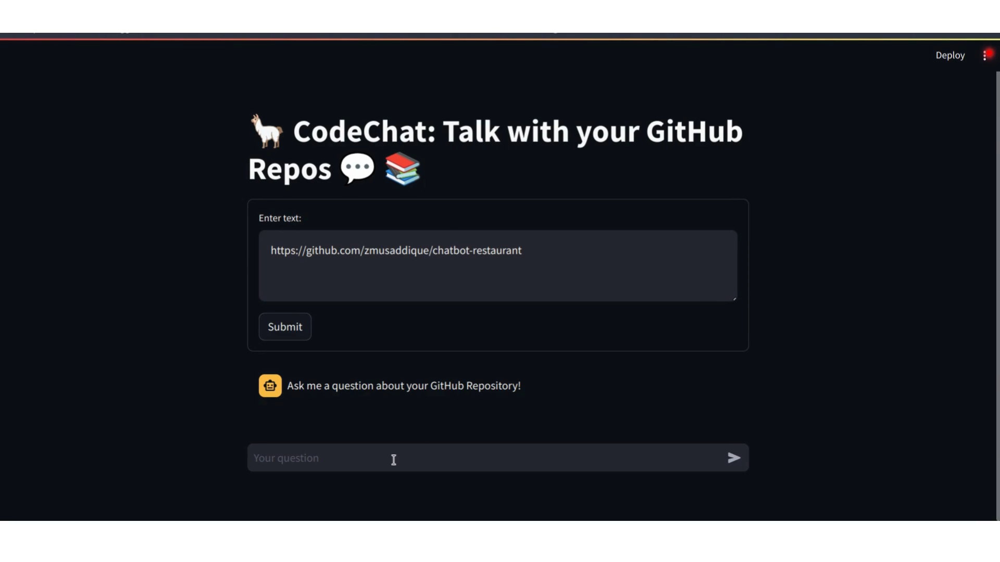
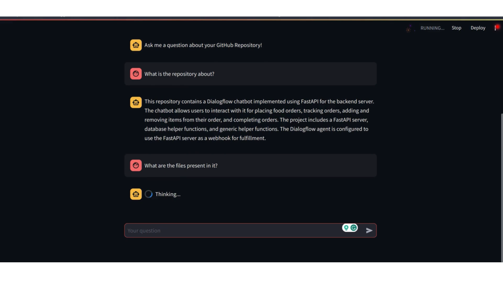

# CodeChat: Talk to GitHub Repos! 

Welcome to CodeChat, a web app that revolutionizes the way you interact with GitHub repositories. CodeChat allows users to seamlessly search and communicate with a GitHub repository using natural language. With the power of llama-index, ChromaDB vector store, and Streamlit, CodeChat offers an innovative and intuitive experience for developers and collaborators.

## Table of Contents

- [Demo](#demo)
- [Screenshots](#screenshots)
- [Overview](#overview)
- [How It Works](#how-it-works)
- [Tech Stack](#tech-stack)
- [RAG Pipeline](#rag-pipeline)
- [Setup](#setup)

## Demo

[](https://vimeo.com/898784359?share=copy)

Click the image above to watch a brief demonstration of CodeChat in action.

## Screenshots


*Index your github repo by providing the URL* 


*Ongoing chat*


## Overview

CodeChat is a web application designed to enhance collaboration and communication among developers working on GitHub repositories. By integrating llama-index for efficient code search, ChromaDB vector store for semantic understanding, and Streamlit for a user-friendly interface, CodeChat streamlines the process of querying and discussing code.

## How It Works

1. **Enter GitHub URL:** Users start by entering the URL of the GitHub repository they want to explore and communicate with.

2. **Natural Language Interaction:** Once the repository is loaded, users can interact with the codebase using natural language queries. CodeChat leverages a unique combination of keyword search (bm25), vector indexing, and reranking to provide accurate and relevant results.

3. **Chat Interface:** The chat interface allows users to ask questions, seek code snippets, or discuss specific parts of the codebase. Responses are generated based on the RAG pipeline, providing a more contextual and meaningful interaction.

## Tech Stack

- **llama-index:** Efficient and fast code search engine.
- **Chroma DB:** Creating Vector Store and Semantic Understanding of code.
- **Streamlit:** User-friendly web application framework.

## RAG Pipeline

CodeChat employs a RAG (Retrieval-Augmented Generation) pipeline that involves __fusion of keyword and vector search__ to enhance the interaction between users and code repositories. The pipeline involves:

- **Keyword Search (bm25):** Initial retrieval of relevant code snippets based on keyword queries.
- **Vector Indexing:** Semantic understanding and representation of code using ChromaDB's vector store.
- **Reranking:** Fine-tuning and reranking of results to provide more accurate and context-aware responses.

## Setup

To set up CodeChat locally, follow these steps:

1. **Clone the Repository:**
   ```bash
   git clone https://github.com/zmusaddique/codechat.git
   cd codechat
   ```

2. **Install Dependencies:**
   ```bash
   pip install -r requirements.txt
   ```

3. **Run the Application:**
   ```bash
   streamlit run app.py
   ```

4. **Open in Browser:**
   Open your web browser and go to http://localhost:8501 to access CodeChat.

## Environment Variables

Before running CodeChat, you need to set up a `.env` file to configure the necessary environment variables. Follow these steps:

1. **Modify the `.env` File:**
   Find the file named `.env` in the root directory of your CodeChat project.

2. **Add the Following Variables:**
   Open the `.env` file in a text editor and add the following variables:

   ```env
   # GitHub API Token (Generate one at https://github.com/settings/tokens)
   GITHUB_API_TOKEN=your-github-api-token

   # Hugging Face API Token (Generate one at https://huggingface.co/signup)
    HUGGING_FACE_API_TOKEN=your-hugging-face-api-token
   ```

   Replace `your-github-api-token` with your GitHub API token. If you don't have one, you can generate it [here](https://github.com/settings/tokens).

3. **Save the File:**
   Save the changes to the `.env` file.

Now, when you run CodeChat, it will automatically read these environment variables to connect to the GitHub API, llama-index, and HuggingFace.

Make sure to keep your `.env` file secure and never share it publicly, as it may contain sensitive information. If you deploy CodeChat in a production environment, ensure that proper security measures are taken to protect these credentials.

Now you're ready to explore and chat with GitHub repositories using CodeChat!

Feel free to contribute, report issues, or suggest improvements. Happy coding! :)